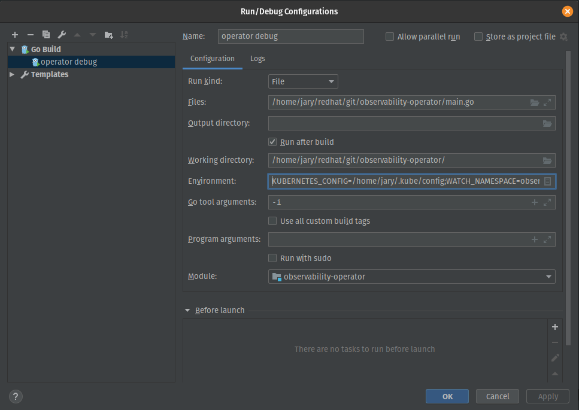

# Observability Operator

<!-- we could/should add unit/integration/'go report' type badges IMO /-->


## What Is It?

The Observability Operator deploys & maintains a common platform for Application Services to share and utilize to aid in monitoring & reporting on their service components.
It integrates with the [Observatorium](https://github.com/observatorium) project for pushing metrics and logs to a central location.


## What's included?    

### Prometheus

[Prometheus](https://prometheus.io/) is a free software application used for event monitoring and alerting. 
It records real-time metrics in a time series database built using a HTTP pull model, with flexible queries 
and real-time alerting.

Prometheus's [Alertmanager](https://prometheus.io/docs/alerting/latest/alertmanager/) is also supported, which 
handles alerts sent by Prometheus & takes care of deduplicating, grouping, and routing them to the correct 
receiver integration (such as, in our case, [PagerDuty](https://www.pagerduty.com/docs/guides/prometheus-integration-guide/)). 
It also takes care of silencing and inhibition of alerts.

### Grafana

[Grafana](https://grafana.com/) is a multi-platform open source analytics and interactive visualization web 
application. When configured with supported data sources, Grafana provides charts, graphs, and other visualizations 
via UI dashboards.

### Promtail

[Promtail](https://grafana.com/docs/loki/latest/clients/promtail/) is a log aggregator for Loki, Grafana's platform for collecting and analyzing logs.
Loki is the logging backend used in Observatorium.

## How do we integrate our service with Observability?

If you find yourself asking, chances are good a conversation's already been started in that regard, but if not, 
reach out! It'll likely be a bit more involved than plug-and-play and we'd like to make sure we support your 
needs. That being said (and know that what follows is absolutely subject to change)...

Observability Operator is intended to support multiple application services, each of which will be responsible for 
maintaining their own configuration repository & instantiating a ConfigMap containing a bit of information the 
operator needs in order to read from it. At current, it's expected that configuration repos reside within our 
['bf2' organization](https://github.com/bf2fc6cc711aee1a0c2a) as we use a special read-only mechanism limited to 
within our organization for access. 

As an example, first take a look at the [configuration repository](https://github.com/bf2fc6cc711aee1a0c2a/observability-resources-mk) 
for the first service we've onboarded, Managed Kafka. There you'll find an index file and various configuration files referenced from within. In order to use this config 
repo, the Observability Operator must be told about it via a `Secret`:

```yaml
kind: Secret
apiVersion: v1
metadata:
  name: kafka-observability-configuration
  namespace: kafka-observability
  labels:
    configures: observability-operator
data:
  access_token: '<token here>'
  channel: 'resources'
  repository: 'https://api.github.com/repos/bf2fc6cc711aee1a0c2a/observability-resources-mk/contents'
  tag: <tag or branch>
```

The Observability Operator doesn't care too much about what namespace the Secret resides in (that's not to say that 
we won't have an opinion, though!). Instead, it scans all namespaces for any Secrets matching a particular label set 
as specified in the Observability CR (more on that in a bit):
```yaml
  configurationSelector:
    matchLabels:
      configures: "observability-operator"
```

## What's supported via external config?

Within a given resources folder an [index.json file](https://github.com/bf2fc6cc711aee1a0c2a/observability-resources-mk/blob/main/development/index.json) 
containing, at a minimum, `id` and `config` fields must exist:
 ```yaml 
 {
   "id": "shiny-managed-service-development",
   "config": {...}
 }
```
The `id` field (specifying both the service and channel) is used by the observability operator to label & track
various generated resources.

The `config` field may contain various entries as appropriate for your service:
* `config.grafana.dashboards` expects an array list of `subdirectory/file.yaml` entries, each pointing to a complete Grafana 
Dashboard YAML definition file:
   ```yaml
    "grafana": {
     "dashboards": [
       "grafana/foo-dashboard.yaml",
       "grafana/bar-dashboard.yaml",
     ]
    },
   }
   ```
* `config.promtail` specifies whether Promtail should be used and, if so, a namespace label selector for matching:
  ```yaml
    "promtail": {
      "observatorium": "default"
      "enabled": true,
      "namespaceLabelSelector": {
        "app": "strimzi"
      }
    },
  ``` 
* `config.promtail.observatorium` specifies the `id` of the Observatorium config to forward logs to 
* `config.alertmanager` indicates the name of two prerequisite secrets assumed to pre-exist on the cluster for configuration 
of Prometheus PagerDuty & Alertmanager integrations:
  ```yaml
    "alertmanager": {
      "pagerDutySecretName": "pagerduty",
      "deadmansSnitchSecretName": "deadmanssnitch"
    },
  ```
* `config.promtail.observatorium` specifies the id of an observatorium config where the logs are written to
* `config.prometheus.pod_monitors` expects an array list of `sub/directory/file.yaml` entries, each pointing to a complete 
Prometheus [PodMonitor YAML definition](https://docs.openshift.com/container-platform/4.6/rest_api/monitoring_apis/podmonitor-monitoring-coreos-com-v1.html) 
file:
  ```yaml
    "prometheus": {
        "pod_monitors": [
          "prometheus/pod_monitors/foo-monitor.yaml",
          "prometheus/pod_monitors/bar-monitor.yaml",
    ],
  ```
* `config.prometheus.rules` expects an array list of `sub/directory/file.yaml` entries, each pointing to a complete 
[PrometheusRule YAML definition](https://docs.openshift.com/container-platform/4.6/rest_api/monitoring_apis/prometheusrule-monitoring-coreos-com-v1.html) 
file: 
  ```yaml
    "rules": [
      "prometheus/prometheus-rules.yaml"
    ],
  ```
* `config.prometheus.federation` expects a single `subdirectory/file.yaml` location pointing to a file containing an 
array of regex patterns to be concatenated & used in instantiating a Prometheus [additional scrape config secret](https://github.com/prometheus-operator/prometheus-operator/blob/master/Documentation/additional-scrape-config.md):
  ```yaml
  "federation": "prometheus/federation-config.yaml",
  ```

* `config.prometheus.observatorium` specifies the `id` of the Observatorium config to forward metrics to

* `config.prometheus.remoteWrite` expects a single `subdirectory/file.json` location pointing to a file containing an 
array of regex patterns to be concatenated & used in instantiating the Prometheus operand (CR): 
  ```yaml
    "remoteWrite": "prometheus/remote-write.json"
  ```

* `config.observatoria` an array of observatorium configs, each with an id referenced by prometheus and/or promtail:
  ```yaml
    [{
      "id": "default"
      "gateway": "https://your.gateway.url",
      "tenant": "test",
      "authType": "dex",
      "dexConfig": {
        "url": "http://your.dex.url",
        "credentialSecretName": "observatorium-dex-credentials"
      }
    }, ...]
  ```

## What's required in the Observability operand (CR)?
Your spec will be required to specify, at a minumum, two things:
* a `resyncPeriod` to indicate how often external config should be re-fetched
* a `configurationSelector` indicating what labels to match when scanning for external config info ConfigMaps as 
previously mentioned 
```yaml
  apiVersion: observability.redhat.com/v1
  kind: Observability
  metadata:
    name: observability-sample
  spec:
    resyncPeriod: 1h
    configurationSelector:
      matchLabels:
        configures: "observability-operator"
```

## What's optionally supported via the Observability operand (CR)?

* Prometheus storage config
  ```yaml
  spec:
    storage:
      prometheus:
        volumeClaimTemplate:
          spec:
            storageClassName: ssd
            resources:
              requests:
                storage: 40Gi
  ```
* Node Tolerations
  ```yaml
  spec:
    tolerations:
    - effect: NoSchedule
      key: node-role.kubernetes.io/infra
      operator: Exists
  ```
* Node Affinities
  ```yaml
  spec:
    affinity:
      nodeAffinity:
        requiredDuringSchedulingIgnoredDuringExecution:
          nodeSelectorTerms:
            - matchExpressions:
              - key: node-role.kubernetes.io/infra
                operator: Exists
  ```


## Running Locally

### Prerequisite Tools

* golang 1.15+
* operator-sdk v1.1.0
* [CodeReady Containers](https://github.com/code-ready/crc) 1.18 (OCP 4.6.1) or later
* [OpenShift command line tool](https://developers.redhat.com/openshift/command-line-tools)

### Setting up your cluster

- We recommend targeting a local CRC instance for daily development. Though we're hedging our bets a bit with these 
amounts, we do feel additional memory config params are essential in having a stable platform to run against:
```
crc start --pull-secret-file $HOME/.crc/cache/pull-secret.txt --cpus 6 --memory 24576`
```
- Once your cluster is up and running, determine which (or create a new) namespace to target with various generated 
files. The operator will look in this namespace for an Observability operand (CR) and if not found, generate its own. 
In order for it to do so, you need to indicate the namespace in one of two ways:
  - specify the `WATCH_NAMESPACE=foo` environment variable when running
  - create a file containing only the namespace name at `/var/run/secrets/kubernetes.io/serviceaccount/namespace`
  to emulate a pod environment & prevent having to supply the env var every run.  

### Adding requisite resources
Note that some files require values that are not supplied here or within sample files for security reasons - please 
review the content of each!

* PagerDuty secret:
  ```
  oc apply -f config/samples/secrets/pagerduty.yaml
  ```

* DeadmansSnitch secret:
  ```
  oc apply -f config/samples/secrets/deadmanssnitch.yaml
  ```
  
* Dex config secret:
  ```
  oc apply -f config/samples/secrets/observatorium-dex-credentials.yaml
  ```

* External config repo secret:
    * The Observability stack requires a Personal Access Token to read externalized configuration from within the bf2 organization. For development cycles, you will need to generate a personal token for your own GitHub user (with bf2 access) and place the value in the Secret. 
    * To generate a new token:
        * Follow the steps [found here](https://docs.github.com/en/github/authenticating-to-github/creating-a-personal-access-token), making sure to check **ONLY** the `repo` box at the top of the scopes/permissions list (which will check each of the subcategory boxes beneath it).
        * Copy the value of your Personal Access Token to a secure private location. Once you leave the page, you cannot access the value again & you will be forced to reset the token to receive a new value should you lose the original.
        * Take care not to push your PAT to any repository as if you do, GitHub will automatically revoke your token as soon as you push, and you'll need to follow this process again to generate a new token.
    * Apply the Secret with token value substituted in:
      ```
      oc apply -f config/samples/secrets/observability_secret.yaml
      ```


### Running via `Makefile`
If this is the first time you've run against the cluster (or your CRD has changed and been uninstalled):
```
make install
```

Run the operator as a local process: 
```
make run ENABLE_WEBHOOKS=false
```

alternatively, you can deploy the operator's latest image to your cluster:
```
make deploy
```

### Running via IntelliJ


* If you encounter errors regarding PrometheusRule validation webhooks, you can use the following:
  ```
  oc delete ValidatingWebhookConfiguration prometheusrules.openshift.io
  ```

### Running via VS Code
Add the following into your `launch.json` file to enable running and debugging.

```     
"version": "0.2.0",
    "configurations": [{
      "name": "Observability Operator",
      "type": "go",
      "request": "launch",
      "mode": "auto",
      "program": "${workspaceFolder}/main.go",
      "env": {
        "WATCH_NAMESPACE": "kafka-observability",
        "KUBERNETES_CONFIG": "~/.kube/config",
        "OPERATOR_NAME": "observability-operator"
      },
      "cwd": "${workspaceFolder}",
      "args": []
    }]
  }
```

  
## Roadmap

Please refer to our [JIRA epic](https://issues.redhat.com/browse/MGDSTRM-717) for a list of completed, ongoing & upcoming work.


## Contributing

1. Fork the Project
2. Create your Feature Branch (`git checkout -b feature/AmazingFeature`)
3. Commit your Changes (`git commit -m 'Add some AmazingFeature'`)
4. Push to the Branch (`git push origin feature/AmazingFeature`)
5. Open a Pull Request


## Issues

If you'd like to report an issue, feel free to use our [project Issues page](https://github.com/bf2fc6cc711aee1a0c2a/observability-operator/v3/issues) - just remember that we're not fully tracking ongoing work there, but in [JIRA](https://issues.redhat.com/browse/MGDSTRM-717) instead.  


## Contact

If all else fails, you can reach us at mk-config-user\[at\]redhat.com
